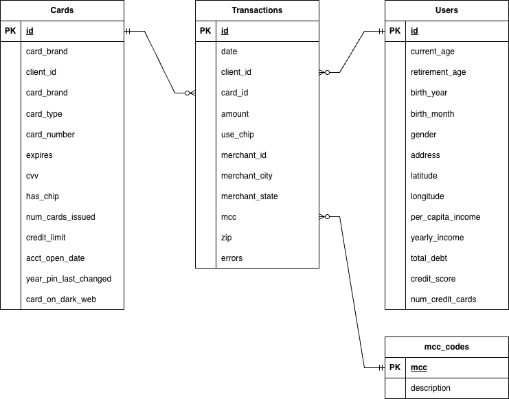

# Fraud Detection Pipeline
Welcome to the **Fraud Detection Repository**!
This project demonstrates an end-to-end machine learning solution, from building a data ingestion pipeline to comparing and evaluating models. 
End-to-end machine learning pipeline for detecting fraudulent credit card transactions using LightGBM.

---

## Objective
Detect fraudulent transactions using structured transactional user data. The dataset is highly imbalanced, requiring
feature engineering and class-weighted modelling.

## Data
The dataset used in this project is the **Financial Transactions Dataset: Analytics** by *computingvictor*, publically
available on Kaggle. 

> 📦 [Financial Transactions Dataset – Kaggle](https://www.kaggle.com/datasets/computingvictor/transactions-fraud-datasets/data)

To use this project, download the dataset from the link above and place the files in the `Downloads/archive` directory.

Please review the dataset's license on Kaggle before use.

## Entity Relationship Diagram

The diagram below shows the structure of the raw dataset, covering transactions, users, cards, and labels.

    

## Features
- End-to-end ML pipeline (ingestion to inference)
- Feature engineering pipeline with temporal + financial features
- Handles class imbalance using LightGBM class weighting
- Train/inference separation with saved model artifacts
- Reproducible pipeline using fixed preprocessing logic

## Model
- Algorithm: LightGBM Classifier
- Handles class imbalance via `class_weight="balanced"`
- Evaluation: probability-based fraud scoring